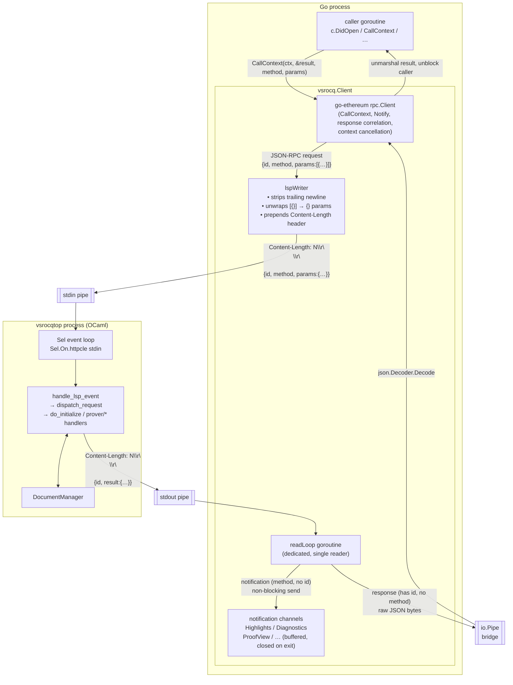
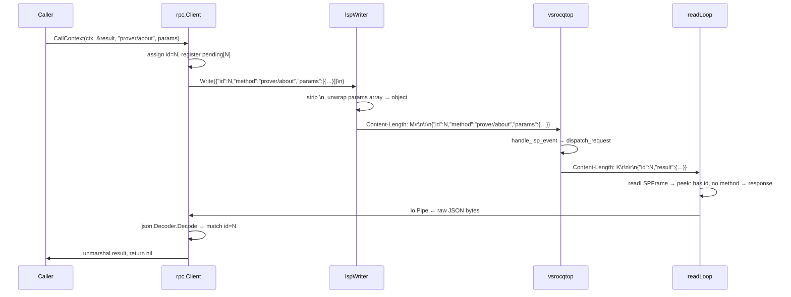
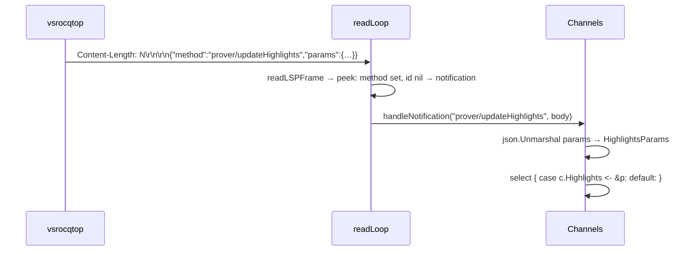

# vsrocq client architecture

## Component overview

## Request / response flow

## Notification flow

## Key design notes

| Concern | Mechanism |
|---|---|
| Request–response correlation | `go-ethereum/rpc.Client` (replaces hand-rolled pending map + channels) |
| Context cancellation | `rpc.CallContext` honours `ctx.Done()` natively |
| LSP Content-Length framing | `readLSPFrame` (read side) + `lspWriter` (write side) |
| Params format mismatch | `unwrapArrayParams`: go-ethereum serialises args as `[{…}]`; lspWriter rewrites to `{…}` before sending |
| Notification dispatch | `readLoop` classifies by `(method≠"", id==nil)` and calls handlers directly; responses go to the pipe |
| Thread safety | `go-ethereum/rpc.Client` serialises all stdin writes internally; no mutex needed in `lspWriter` |
| Fire-and-forget notifications | `notify()` calls `rpc.Client.Notify()` — goes through the same codec path as requests |
| `workers: int option` invariant | `ProofOptions.Workers *int` has no `omitempty`; Go sends `null` which OCaml decodes as `None` |
